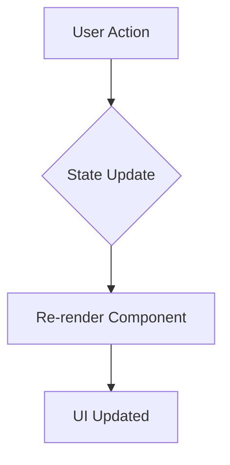

# Sugerencias para complementar "La Absoluta"

Hola Lucien,

A continuación, detallo algunas sugerencias para enriquecer nuestro sistema de memoria "la absoluta", manteniendo su filosofía de ser documentación viva que reside junto al código.

## 1. Diagramas como Código con Mermaid.js

Podríamos integrar diagramas de Mermaid directamente en nuestros archivos Markdown (`.md`). Esto nos permitiría visualizar flujos de datos, arquitecturas de componentes o máquinas de estado de una forma que es mucho más clara que el texto.

**Beneficio:** Los diagramas se versionan con el código y se actualizan fácilmente, proporcionando una referencia visual clara que complementa la documentación escrita.

**Ejemplo (en un .md):**

## 2. Formalizar los "Architecture Decision Records" (ADRs)

Nuestras "Lecciones Aprendidas" son una excelente forma de ADR. Podríamos llevarlo un paso más allá creando un directorio `docs/adr/` donde cada archivo Markdown documente una decisión arquitectónica importante.

**Beneficio:** Crea un registro histórico y consultable del *porqué* detrás de las decisiones técnicas clave, facilitando el mantenimiento y la incorporación de nuevos colaboradores. Un ADR simple podría contener: `Contexto`, `Decisión` y `Consecuencias`.

## 3. Documentación de Componentes con Storybook

Para los componentes de UI, podríamos implementar [Storybook](https://storybook.js.org/). Es una herramienta que nos permite construir y visualizar componentes de forma aislada.

**Beneficio:** Crea un "absoluta" interactivo para la UI. Facilita el desarrollo, las pruebas y la revisión de cada componente en todos sus estados, asegurando consistencia y calidad visual. Es especialmente útil para desacoplar el desarrollo del front-end del back-end.

Estas adiciones harían "la absoluta" aún más robusta, combinando la narrativa de alto nivel con documentación visual y técnica auto-generada.

Saludos,
Robotino
